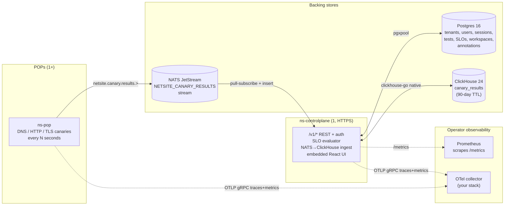

# NetSite

> Self-hosted network observability. Synthetic monitoring + BGP route
> analysis + flow analytics + PCAP analytics, with a cross-domain
> reasoning layer (causal correlation, natural-language incident query,
> what-changed, outage attribution) on top.
>
> **Status:** v0.0.14 — Phase 0 nearly complete (foundation + control
> plane + canaries + SLOs + anomaly detection + netql DSL + workspaces
> + annotations + React shell scaffold). BGP, flow, PCAP, and the
> reasoning layer arrive in Phases 1–4.
>
> **License:** Business Source License 1.1, Change Date 2125-01-01,
> Change License Apache 2.0. See [`LICENSE`](./LICENSE).

---

## What this is, in plain English

You point NetSite at a list of things you want to monitor (URLs, DNS
records, TLS endpoints, eventually BGP prefixes and flow telemetry).
Lightweight agents (called **POPs**, for "points of presence") run
those checks every N seconds from wherever you deploy them. Results
flow through a single control plane that writes them to a time-series
store and exposes them as a REST API + a React dashboard.

On top of that raw data you can:

- **Define SLOs** — "API success rate ≥ 99.9% over 30 days" — and
  get paged via webhook when error budgets burn faster than tolerable
  (multi-window multi-burn-rate per Google SRE Workbook ch. 5).
- **Detect anomalies** — seasonal-aware Holt-Winters / STL detection
  catches "this Tuesday at 03:00 looks weird" without flagging every
  Saturday morning.
- **Query** — write `latency_p95 by pop where target = 'api.example.com' over 24h`
  in a small DSL called netql; we compile it to ClickHouse SQL or
  PromQL depending on where the metric lives.
- **Save & share** — pin a set of views as a workspace, optionally
  share it via a tenant-internal or signed-link short ID.
- **Annotate** — pin operator notes to a (canary, timestamp) tuple
  so the next person reading the timeline knows what happened.

That's Phase 0. Phase 1 adds BGP route analysis (RIS Live + RouteViews
swing detection, MOAS / bogon / RPKI-invalid alerts, route-leak
detection), Phase 2 adds customer-router BMP + drift detection +
white-label status pages, Phase 3 adds NetFlow/sFlow + RUM, Phase 4
adds PCAP + air-gap deployments, Phase 5 adds SSO/HA/compliance.

The full PRD lives outside this repo (workspace-private). The
[`docs/`](./docs/) directory is the in-repo reference.

---

## How the pieces fit together



**Three binaries**, each a single static Go executable:

| Binary | What it does | Where it runs |
|---|---|---|
| `ns-controlplane` | REST API, auth, SLO evaluator, NATS→ClickHouse ingest, embedded React dashboard | One per cluster |
| `ns-pop` | Runs canary tests on a schedule, publishes results to NATS | One per geographic POP (you decide how many) |
| `ns` | Operator CLI. Currently: `ns version`, `ns seed admin`, `ns seed demo` | Anywhere; talks to Postgres directly for seeding |

**Four backing stores** (Docker Compose ships them all for dev):

| Store | What it holds | Why this one |
|---|---|---|
| Postgres 16 | Tenants, users, sessions, tests catalog, SLO definitions, workspaces, annotations | Relational, transactional, mature |
| ClickHouse 24 | Canary results (time-series), eventually flow + BGP + PCAP rows | Built for high-cardinality time-series; flow data would explode Prometheus |
| NATS JetStream | Event bus between POPs and the control plane | Single binary, simpler ops than Kafka, adequate for v1 scale |
| Prometheus | Scrape target for the control plane's own metrics (request rates, evaluator runs) | Industry-standard for service-level metrics |

**Prefixed-TEXT IDs**, not UUIDs (with one exception). When you see
`pop-lhr-01`, `tst-https-api`, `slo-api-success`, `wks-abc12345`,
`ann-deadbeef`, `tnt-default`, `usr-…`, `ses-…`, that's the convention.
The prefix names the kind, the suffix is operator-chosen for POPs and
tests (so you can grep your config) and random hex for everything else.

---

## Quickstart 1 — Dashboard in 60 seconds (no real data)

Goal: see the React dashboard render against the real backend, locally,
over HTTPS, using nothing but Make.

Prerequisites: **Go 1.25+**, **Docker**, **pnpm + Node ≥ 20**.

```sh
git clone https://github.com/shankar0123/netsite
cd netsite

# 1. Bring up Postgres + ClickHouse + NATS + OTel collector + Prometheus + Grafana.
cd deploy/compose && docker compose up -d && cd ../..
./scripts/wait-healthy.sh   # waits for every container to report healthy

# 2. Seed a default tenant + admin user.
make build
NETSITE_SEED_PASSWORD='somethinglongand_secure' \
  ./ns seed admin --email you@example.com --tenant-id tnt-default

# 2b. (Optional but recommended) seed a demo dataset — 3 POPs, 5
#     canaries against well-known public targets (cf 1.1.1.1,
#     google.com, quad9), and one 99.5% / 30-day SLO. Idempotent.
make seed-demo

# 3. Build the React shell + the controlplane with the SPA embedded.
make build-all

# 4. Run the controlplane in TLS mode using an ephemeral self-signed cert.
make run-controlplane-tls
```

That last command binds `https://127.0.0.1:8443`. Open it in your
browser; you'll get a one-time browser warning for the self-signed
cert (the SHA-256 fingerprint is printed in the boot log if you want
to verify it). Click "advanced → proceed", then sign in with the
email + password you used in step 2.

You'll see the dashboard with three cards — backend health, canary
tests (empty), SLOs (empty). That's the bare scaffold; quickstart 2
adds real data.

If you don't want to deal with the browser warning, run `make dev-tls`
once. It uses [mkcert](https://github.com/FiloSottile/mkcert) to install
a local CA into your system trust store and issue a real cert for
`localhost`. From then on, every dev session is browser-clean HTTPS.

### Why we default to HTTPS even on localhost

The architecture invariant **A11** (see [`docs/security.md`](./docs/security.md)
and the relevant entry in `CLAUDE.md`) says every operator-facing
network surface defaults to TLS 1.3+, including dev. Plaintext is
opt-in only — `NETSITE_CONTROLPLANE_ALLOW_PLAINTEXT=true` — and emits
a Warn-level boot log when set. We pay this 30-second tax in dev so
production deploys never accidentally ship over plaintext, which is
the single most common reason acquisition diligence finds a
self-hosted observability product unviable.

---

## Quickstart 2 — Your first canary with real data (10 minutes)

Goal: register a POP, configure a canary against a public URL, run
the POP agent, and watch results appear in the dashboard.

Picking up from quickstart 1 (controlplane running on `:8443`):

```sh
# 1. Save your session cookie so subsequent curls reuse it.
COOKIE_JAR=/tmp/ns-cookies.txt
curl -k -X POST https://localhost:8443/v1/auth/login \
  -H 'Content-Type: application/json' \
  -c $COOKIE_JAR \
  -d '{"tenant_id":"tnt-default","email":"you@example.com","password":"somethinglongand_secure"}'

# 2. Register a POP. The id is yours to choose; convention is pop-<airport>-<NN>.
curl -k -X POST https://localhost:8443/v1/pops \
  -H 'Content-Type: application/json' -b $COOKIE_JAR \
  -d '{"id":"pop-dev-local","name":"Dev Local","region":"local"}'

# 3. Configure a canary test. The server mints the id (tst-<short>).
curl -k -X POST https://localhost:8443/v1/tests \
  -H 'Content-Type: application/json' -b $COOKIE_JAR \
  -d '{
    "kind":"http",
    "target":"https://example.com/",
    "interval_ms": 30000,
    "timeout_ms": 5000,
    "config": {"method":"GET", "expected_status": 200}
  }'
# → returns {"id":"tst-abc12345", ...}

# 4. Point a POP agent at the controlplane and run it.
cat > /tmp/pop.yaml <<EOF
pop_id: pop-dev-local
nats_url: nats://localhost:4222
tests:
  - id: tst-abc12345          # use the id from step 3
    tenant_id: tnt-default
    kind: http
    target: https://example.com/
    interval_ms: 30000
    timeout_ms: 5000
EOF
NETSITE_POP_CONFIG=/tmp/pop.yaml ./ns-pop &

# 5. Wait ~30 seconds, then query results:
curl -k -b $COOKIE_JAR \
  "https://localhost:8443/v1/tests/tst-abc12345/results?limit=5"
```

You should see five rows of canary results — `latency_ms`, `error_kind`,
the per-phase timing breakdown, the POP id. Refresh the dashboard at
`https://localhost:8443` and the canary card now shows count + the
test you just made.

In the React shell, `tst-abc12345` is what shows up in the dashboard
"Canary tests" card. Click through (when v0.0.15+ ships the detail
view) to see the timeline + a sparkline of latency.

---

## How to read the dashboard

Once the React shell has data, here's what each surface means:

**Top bar.** Brand on the left, navigation on the right (Dashboard,
Login). Active link is highlighted.

**Backend health card.** Pulls from `GET /v1/health`. The `version` /
`commit` are baked into the binary at build time (via `-ldflags`).
Each backend is "up" or "down: <reason>". This is the first place
to check when the page works but data doesn't appear — if `clickhouse`
is "down: dial tcp …", your canary results are NOT being ingested.

**Canary tests card.** Count of every test in your tenant (server-
filtered automatically — you cannot see another tenant's tests).
Shows the first 4 rows with id, kind, and interval (e.g.,
`tst-abc12345  http · 30s`). Test ids are stable for the lifetime
of the test; deleting a test never reuses the id.

**SLOs card.** Count of SLO definitions and their objective percentage
(e.g., `99.9%`). Deleting an SLO cascades the underlying state row
in Postgres; results in ClickHouse are kept.

When the v0.0.15+ route expansion lands, each card becomes a clickable
detail page (canaries timeline, SLO burn-rate chart, etc.). For now,
the dashboard is the catalog snapshot view.

---

## How to make sense of the SLO numbers

An **SLO** (service-level objective) is a target like "the API success
rate over the last 30 days should be ≥ 99.9%". Whether you're meeting
it depends on:

- **Total events**: how many canary runs there were in the window.
- **Bad events**: how many returned an error.
- **Error budget**: `(1 − objective) × total`. For 99.9% over 30 days
  with one canary every 30 seconds, that's ~86 errors allowed.
- **Burn rate**: `bad_events / (allowed_bad_events × elapsed_window_fraction)`.
  Burn rate of 1.0 means you're spending budget exactly as fast as it
  comes in. 14.4 means you'll exhaust 30 days of budget in 1 hour.

NetSite's evaluator runs every 30 seconds. For each enabled SLO it
checks **four windows simultaneously** (per the SRE Workbook ch. 5
recipe):

| Window | Burn-rate threshold | What it catches |
|---|---|---|
| 5 minutes (short) AND 1 hour (long) | 14.4 | "Fast burn" — outage in progress, page now |
| 30 minutes (short) AND 6 hours (long) | 6.0 | "Slow burn" — degradation, ticket |

Both the short and long windows have to exceed threshold for the
condition to fire. That's what eliminates the false positives that
plain single-window burn-rate alerting suffers from.

When an SLO fires, the configured webhook (you supply `notifier_url`
on creation; must be `https://` unless you opt in via internal-only
config) gets a JSON `BurnEvent` payload with the SLO id, current
burn rate, status, and the windows. Recovery webhooks are intentionally
deferred to Phase 1 — today's loop is "fire on burn, log on recovery".

The full algorithm doc is at
[`docs/algorithms/multi-window-burn-rate.md`](./docs/algorithms/multi-window-burn-rate.md).

---

## What else you can do today (Phase 0 surfaces)

**Run a netql query.** Once `/v1/netql` is wired in v0.0.15, you'll
hit the dashboard's `/netql` route. Today, programmatic use:

```go
import "github.com/shankar0123/netsite/pkg/netql"

q, _ := netql.Parse("latency_p95 by pop where target = 'api.example.com' over 24h")
out, _ := netql.TranslateClickHouse(q, netql.DefaultRegistry(), "tnt-default")
fmt.Println(out.SQL)   // parameterised SQL with tenant_id = $1 always injected
```

The metric set is `success_rate`, `latency_p95`, `count` over the
canary results table; `request_rate` and `request_latency_p95` over
the controlplane's HTTP middleware metrics (PromQL backend). The
language doc is [`docs/algorithms/netql-language.md`](./docs/algorithms/netql-language.md).

**Save a workspace.** A workspace is a list of pinned views (each
view is a name + URL/deep-link + optional note). Useful when you
want to revisit the same set of charts every Monday morning. POST to
`/v1/workspaces`; share via `POST /v1/workspaces/{id}/share` (default
7-day expiry; default tenant-internal — anyone in your tenant can
read it via `/v1/share/{slug}`). The full schema is in the OpenAPI
spec at [`api/openapi.yaml`](./api/openapi.yaml).

**Pin an annotation.** When something interesting happens — outage,
deploy, config change — POST to `/v1/annotations` with a scope
(`canary | pop | test`), a scope_id (`tst-foo`), a timestamp, and a
markdown body. Annotations are immutable; correcting a typo means
delete + recreate so the audit trail stays clean.

**Detect anomalies.** Programmatic only today (no UI surface). The
package `pkg/anomaly` accepts a time-stamped numeric series and
returns a `Verdict` with method (Holt-Winters or simplified STL),
severity (none / watch / anomaly / critical in MAD units), and a
reason string explaining the decision. Calendar suppression is
supported. Algorithm doc:
[`docs/algorithms/anomaly-detection.md`](./docs/algorithms/anomaly-detection.md).

**Capture a JA3/JA4 fingerprint.** TLS canary returns the fingerprint
in `result.ja3` / `result.ja4`. Algorithm doc:
[`docs/algorithms/ja3-ja4-fingerprinting.md`](./docs/algorithms/ja3-ja4-fingerprinting.md).
(Live ClientHello capture is deferred to Phase 1; today the
fingerprint is computed from the negotiated state.)

---

## Configuration reference

Every binary reads its config from environment variables. The naming
convention is `NETSITE_<COMPONENT>_<KEY>`.

### `ns-controlplane`

| Variable | Default | What it does |
|---|---|---|
| `NETSITE_CONTROLPLANE_HTTP_ADDR` | `:8080` | Bind address. Use `127.0.0.1:8443` for AutoTLS. |
| `NETSITE_CONTROLPLANE_DB_URL` | (required) | Postgres DSN. Recommend `sslmode=verify-full` in prod. |
| `NETSITE_CONTROLPLANE_CH_URL` | (required) | ClickHouse URL. Recommend `?secure=true` in prod. |
| `NETSITE_CONTROLPLANE_NATS_URL` | `nats://localhost:4222` | NATS URL. Recommend `tls://...` in prod. |
| `NETSITE_CONTROLPLANE_TLS_CERT_FILE` | unset | PEM cert for TLS-listen mode. |
| `NETSITE_CONTROLPLANE_TLS_KEY_FILE` | unset | PEM key matching the cert. |
| `NETSITE_CONTROLPLANE_ALLOW_PLAINTEXT` | unset | `true` to start without TLS (deliberate opt-in; logs a Warn). |
| `NETSITE_DEV_AUTOTLS` | unset | `true` to mint an ephemeral self-signed cert for loopback bind. **Loopback only.** |
| `NETSITE_AUTH_BCRYPT_COST` | `12` | bcrypt cost factor for password hashing. Floor 10. |
| `NETSITE_OTEL_ENABLED` | `true` | Emit OpenTelemetry traces + metrics. |
| `NETSITE_OTEL_OTLP_ENDPOINT` | `localhost:4317` | OTLP gRPC endpoint. |
| `NETSITE_OTEL_INSECURE` | `true` (dev compose) | Skip TLS on the OTLP gRPC connection. **Set to `false` in prod.** |

### `ns-pop`

| Variable | Default | What it does |
|---|---|---|
| `NETSITE_POP_CONFIG` | (required) | Path to YAML config. See `deploy/compose/pop.example.yaml`. |
| `NETSITE_OTEL_*` | as above | Same OTel env contract as the control plane. |

The POP YAML config covers `pop_id`, `nats_url`, and a list of tests
with id / tenant_id / kind / target / interval / timeout / protocol-
specific config (e.g., HTTP method + expected status; DNS record type;
TLS InsecureSkipVerify).

### `ns` (CLI)

| Subcommand | What it does |
|---|---|
| `ns version` | Prints version, commit, build date. |
| `ns seed admin` | Creates a tenant + admin user. Reads `NETSITE_SEED_PASSWORD` (preferred) or `--password` flag. |
| `ns seed demo` | Inserts a starter dataset under `--tenant-id` (default `tnt-demo`): 3 POPs, 5 canaries against well-known public targets, 1 SLO at 99.5% / 30d. Idempotent. |

---

## Production deployment checklist

The control plane refuses to start unless one of these is true:

1. `NETSITE_CONTROLPLANE_TLS_CERT_FILE` AND `NETSITE_CONTROLPLANE_TLS_KEY_FILE`
   are both set (TLS-listen mode), **or**
2. `NETSITE_CONTROLPLANE_ALLOW_PLAINTEXT=true` (you're running behind
   a TLS-terminating reverse proxy — Caddy, nginx, AWS ALB, GCP HTTPS LB).

In addition:

- Postgres DSN includes `sslmode=verify-full` (or stronger).
- ClickHouse URL includes `secure=true`.
- NATS URL is `tls://...` between control plane and POP agents.
- `NETSITE_OTEL_INSECURE=false` (or unset, default true is dev-only).
- Every SLO `notifier_url` is `https://` (the notifier rejects plain
  HTTP at construction time; the only escape hatch is setting
  `AllowInsecure: true` on the struct, intended for internal-only
  receivers).
- Cookie `Secure=true` is already enforced by the auth layer.
- `Strict-Transport-Security` header is set automatically when
  TLS-listen mode is active.

The full trajectory-wide TLS posture (Phases 0 through 5, including
BGP / RUM / PCAP / SSO / mTLS) is documented in
[`docs/security.md`](./docs/security.md).

---

## Troubleshooting

**The browser warning on AutoTLS won't go away.** That's expected —
the cert is self-signed. Two options: (a) accept it once per browser
session, (b) run `make dev-tls` to install an mkcert-issued cert into
your system trust store. The mkcert flow is the recommended dev path.

**`make run-controlplane-tls` fails with "refusing to bind self-signed
cert to non-loopback".** AutoTLS only works on loopback addresses
(`127.0.0.1`, `::1`, `localhost`). If you set `NETSITE_CONTROLPLANE_HTTP_ADDR`
to anything else, AutoTLS refuses by design — a self-signed cert on a
non-loopback interface is the foot-gun we're preventing. Either bind
to loopback, or supply a real cert via `_TLS_CERT_FILE` / `_TLS_KEY_FILE`.

**Login returns 401 even though the password is right.** Most common
cause: case-sensitive tenant_id mismatch. The tenant_id is `tnt-default`
unless you specified `--tenant-id` to `ns seed admin`. The email is
case-insensitive (Postgres `citext` column).

**Canary results don't appear in `/v1/tests/{id}/results`.** Check
in order: (1) `GET /v1/health` shows ClickHouse "up", (2) `ns-pop` is
running and connected to the same NATS as the controlplane, (3) the
test id in the POP YAML matches the id returned by `POST /v1/tests`.
The data path is POP → NATS subject `netsite.canary.results.<test-id>`
→ controlplane consumer → ClickHouse `canary_results`.

**The dashboard shows backend health "down: …" for ClickHouse.**
ClickHouse takes 5–10 seconds to accept connections after the
container starts. `./scripts/wait-healthy.sh` waits for every
container to report healthy; run it before starting the controlplane.

**Postgres migration fails on `ALTER TYPE`.** It shouldn't — every
constraint we use is `CHECK (col IN (...))` instead of `ENUM` for
exactly this reason (CHECK extends in a single forward migration;
`ALTER TYPE … ADD VALUE` cannot run inside a transaction). If you
hit this, you've probably modified a migration file in place; the
fix is to add a new forward migration, not edit an applied one.

---

## Build, test, lint

```sh
make build              # builds ns, ns-controlplane, ns-pop
make build-web          # builds the React shell into web/dist/
make embed-web          # builds frontend + copies into the embed location
make build-all          # chains embed-web + build (full single-binary deploy)

make test               # unit tests with race detector
make test-integration   # integration tests (-tags integration; needs Docker)
make lint               # golangci-lint
make vet                # go vet (with and without integration tag)
make fmt                # gofmt -w .

make run-controlplane       # plaintext (NETSITE_CONTROLPLANE_ALLOW_PLAINTEXT=true)
make run-controlplane-tls   # AutoTLS on 127.0.0.1:8443 — recommended for dev
make run-pop                # runs ns-pop with deploy/compose/pop.example.yaml
make dev-tls                # one-time mkcert install + cert issue under deploy/dev-certs/
```

Coverage gates live in `CLAUDE.md` and are enforced per-package in
CI: algorithm packages ≥ 95%, service layer ≥ 90%, handler layer
≥ 85%, store packages ≥ 80%, frontend ≥ 80%, repository-wide rolling
≥ 85%. A PR that drops repo-wide coverage by more than 0.5
absolute percentage points without justification is rejected.

---

## Where to learn more

| Doc | When to read it |
|---|---|
| [`docs/security.md`](./docs/security.md) | Trajectory-wide TLS / encryption / access-control posture. Read before any production deploy. |
| [`docs/algorithms/multi-window-burn-rate.md`](./docs/algorithms/multi-window-burn-rate.md) | The SLO math in detail. Read before defining your first SLO. |
| [`docs/algorithms/anomaly-detection.md`](./docs/algorithms/anomaly-detection.md) | Holt-Winters + STL + calendar suppression. Read before tuning anomaly thresholds. |
| [`docs/algorithms/netql-language.md`](./docs/algorithms/netql-language.md) | netql grammar (locked EBNF), type system, ClickHouse + PromQL translation rules. |
| [`docs/algorithms/ja3-ja4-fingerprinting.md`](./docs/algorithms/ja3-ja4-fingerprinting.md) | What the fingerprints mean and when they help. |
| [`api/openapi.yaml`](./api/openapi.yaml) | The full REST surface. |
| `CLAUDE.md` (workspace root, not in repo) | Project constitution: architecture decisions A1–A11, code standards, testing discipline, "Done" definition. |

---

## Security

Use GitHub's private vulnerability reporting at
<https://github.com/shankar0123/netsite/security/advisories/new>. See
[`SECURITY.md`](./SECURITY.md). Do not file public issues for
security reports.

Architecture invariant **A11**: every operator-facing network surface
defaults to TLS 1.3+. Plaintext is opt-in via explicit env var and
emits a Warn-level log line at boot. Production deploys must not need
the plaintext opt-in. Full posture in
[`docs/security.md`](./docs/security.md).

---

This repository is single-owner. External code contributions to the
core repo are not accepted (catalog repos under
[`shankar0123/netsite-providers`](https://github.com/shankar0123/netsite-providers),
[`shankar0123/netsite-bgp-catalog`](https://github.com/shankar0123/netsite-bgp-catalog),
and `shankar0123/netsite-presets` accept community PRs since their
content is mostly facts).
