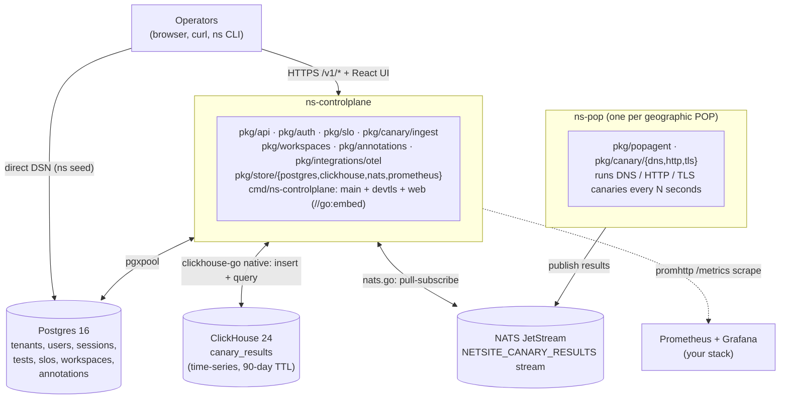
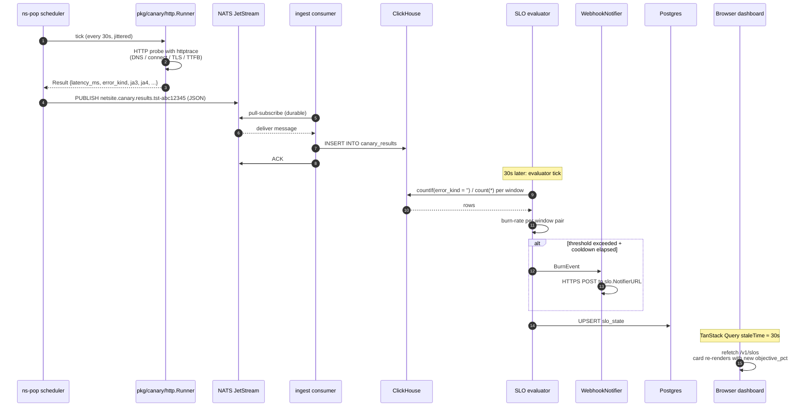

# NetSite architecture

> System-wide what / how / why for every component shipped in
> Phase 0. Audience: anyone who needs to debug across the
> component boundaries, evaluate whether to extend a package, or
> answer an acquisition-diligence question about how the pieces
> connect. Phase 1+ components are noted at the end of each
> section as "what's coming".
>
> Per CLAUDE.md, this doc is **moat material** — the architecture
> doc set is what makes this project diligence-grade. Out-of-date
> entries here are a P2 issue.

---

## The shape, in one diagram

---

## ns-controlplane (cmd/ns-controlplane)

**What it owns.** The HTTP API surface (`/v1/*` REST + the React
SPA). The auth flow (cookies, bcrypt, RBAC). The SLO evaluator
goroutine. The NATS-to-ClickHouse ingest consumer. The OTel
trace + metric pipelines. The embedded `web/dist/` bundle. The
production TLS-listen mode + dev AutoTLS (loopback only).

**How it talks to the others.** `pgxpool` to Postgres for all
config / catalog reads + writes. `clickhouse-go/v2` (native
protocol, not HTTP) for canary_results inserts + queries.
`nats.go` for the JetStream subscription + the
`netsite.canary.results.>` stream. `promhttp` to expose
`/metrics`. OTel via `otlpmetricgrpc` + `otlptracegrpc` to
whatever collector the operator points at.

**Why one binary that owns everything (vs. splitting auth /
canary-ingest / SLO-evaluator into separate services).** The
single-binary deploy is an architectural goal — one signed
binary the operator transfers, one process they monitor, one
log stream they tail. At v0 scale the SLO evaluator runs every
30 seconds; the ingest consumer is one goroutine; there is no
benefit to splitting them. If a customer hits the scale where
the evaluator and the API server must be horizontally scaled
independently, the SLO evaluator is the obvious extraction
point — its Reader interface is already narrow enough that a
"slo-evaluator" sibling binary is a few hours of work, not a
re-architecture.

**Boot order.** OTel → Postgres connect + migrate → Prometheus
registry → NATS connect + JetStream + EnsureStream → ClickHouse
connect + apply schema → ingest consumer goroutine → auth
service → SLO evaluator goroutine → workspaces + annotations
service → API server with TLS-listen-or-plaintext-opt-in
validation → SetHandler composing the SPA + API → ListenAndServe.
Each phase has a distinct exit code so an operator reading boot
logs can tell which phase failed without grepping.

**What's coming.** Multi-controlplane HA with leader election
(Phase 5). Per-region routing of incoming canary results
(Phase 3, alongside the flow ingest scale jump).

---

## ns-pop (cmd/ns-pop, pkg/popagent)

**What it owns.** A scheduler that runs canary tests on their
configured intervals; a publisher that ships results to NATS;
a YAML config loader; the mesh-canary glue (POP-to-POP roster).

**How it talks to the others.** Reads its config from a YAML
file at the path `NETSITE_POP_CONFIG`. Connects to NATS
(controlplane manages the stream + retention). Calls into
`pkg/canary/{dns,http,tls}` to actually run the probes. Emits
OTel traces so the round-trip from canary fire to ClickHouse
insert is one trace.

**Why YAML config rather than discovery from the controlplane.**
Air-gap deployments need POPs that come up before the control
plane is reachable. A YAML on disk works in any deployment
mode; a "fetch your config from the controlplane on boot" model
breaks during partitions. The trade-off is "operator has to
update the YAML when tests change" — acceptable because the
catalog churn is operator-driven anyway.

**Why one goroutine per test.** Tests are independent. A slow
DNS canary should not block a fast HTTP canary. Goroutines are
the right unit. The startup jitter (within `[0, interval)`)
prevents the thundering-herd pattern when 50 tests with a 30s
interval all fire at boot.

**Mesh mode.** YAML's `mesh.peers` lists the other POPs you want
this one to probe. The agent generates one HTTP test per peer
with a deterministic id (`tst-mesh-<self>-<peer>`) so the rows
are correlatable on the controlplane side. We do NOT autodiscover
peers via NATS — see "Why YAML config" above.

**What's coming.** ICMP probes (Phase 1). uTLS / custom dialer
for live ClientHello capture (Phase 1, makes JA3/JA4 actually
useful). Per-POP NATS auth (Phase 5).

---

## ns (cmd/ns)

**What it owns.** The operator CLI. Today: `ns version`, `ns
seed admin`. Tomorrow: every operator workflow that benefits
from being scriptable instead of being a curl chain.

**How it talks to the others.** `ns version` is offline. `ns
seed admin` connects to Postgres directly using
`NETSITE_CONTROLPLANE_DB_URL` and writes the tenant + user rows.

**Why the CLI talks to Postgres directly for `seed admin`.**
First-time bring-up has a chicken-and-egg: the controlplane
won't accept logins until there's a user, but creating the
first user via the API requires being logged in. Talking to
Postgres directly is the cleanest break.

**Why a separate binary rather than `ns-controlplane seed
admin`.** Operators often run the CLI from a different host
than the controlplane (e.g., a bastion). A separate static
binary is easier to ship.

**What's coming.** Per-resource subcommands (`ns canary list`,
`ns slo apply -f file.yaml`, `ns workspace export`) — the Phase
1 operator-experience pass.

---

## pkg/api

**What it owns.** The HTTP server, the route table, the
middleware stack (logging, recovery, OTel, HSTS in TLS-listen
mode), per-resource handlers (auth, tests, pops, slos, results,
workspaces, share, annotations).

**How it talks to the others.** Each handler is a closure over
the relevant dependency (a `*pgxpool.Pool`, an `auth.Service`,
an `slo.Store`, a `workspaces.Service`, an `annotations.Service`,
a ClickHouse connection). The `Config` struct in `server.go`
is the dependency-injection point.

**Why handlers depend on services rather than repos directly.**
Tests can inject in-memory fakes against the service; we get
deterministic unit tests without spinning up Postgres. The
service layer is also where validation lives — handlers stay
focused on HTTP concerns (parse, route, write).

**Why the api package is free of frontend coupling.** The
embed-or-not decision lives in the binary, not in api.
`Server.SetHandler(http.Handler)` lets `cmd/ns-controlplane`
compose the SPA + API at boot; the api package itself never
imports the embedded React shell. This means ns-pop / ns-bgp
can reuse `pkg/api` for their own admin endpoints later
without dragging in a frontend dependency.

---

## pkg/auth

**What it owns.** `User`, `Tenant`, `Session`, `Role` types.
bcrypt password hashing + verification (cost 12 default, floor
10). 16-byte cryptographically-random session ids (`ses-…` /
`usr-…`). The cookie helpers (`Secure; HttpOnly; SameSite=Lax`).
The Postgres-backed `Repo`. The `Service` facade. The RBAC
matrix in `rbac.go` (verb hierarchy `read<write<admin`, role
hierarchy `viewer<operator<admin`).

**How it talks to the others.** `pgxpool` for persistence; the
api package's `middleware.Authenticate` calls `Service.Whoami`
to resolve a session cookie to a user.

**Why opaque cookies, not JWTs.** Server-side opaque sessions
let us revoke instantly. JWTs put the authority in the token —
revoking a JWT means building a blocklist, which negates the
stateless argument JWTs are usually pitched for.

**Why bcrypt cost 12.** ~250 ms per attempt on a 2024-class
CPU — well above the threshold where online brute force matters.
Argon2 is stronger on memory-hard side channels but its tuning
surface is wider and the deployment story is operator-hostile.
The package boundary is narrow enough that switching to Argon2
post-acquisition is a localised change.

---

## pkg/canary + pkg/popagent

**What it owns.** The `Test`, `Result`, `Runner` types. Per-
protocol runners: DNS (stdlib `net.Resolver`), HTTP (stdlib
`http.Client` + `httptrace` for per-phase timing), TLS (stdlib
`crypto/tls` with explicit DNS / connect / handshake split).
JA3 + JA4 fingerprint algorithms.

**How it talks to the others.** The POP agent calls the runners
via the `Runner` interface; results land in NATS via the
publisher. The controlplane's `pkg/canary/ingest` is the other
side — it pull-subscribes the JetStream durable, decodes JSON,
inserts to ClickHouse.

**Why three protocols in v0, not one.** DNS / HTTP / TLS check
distinct failure modes. Running all three against your critical
endpoints catches the union of failures.

**Why pull-subscribe ingest, not push.** Pull semantics give
natural backpressure — if ClickHouse is slow, the consumer
fetches fewer messages, NATS retains the rest, no backpressure
into ns-pop. Push semantics would require us to implement
backpressure ourselves.

**Why the same package owns the protocol implementation AND the
fingerprint computation.** The fingerprint is computed from the
TLS handshake state, which only the protocol implementation has
access to. Splitting them would mean serialising the handshake
state across the package boundary, which is fragile.

---

## pkg/slo

**What it owns.** `SLO`, `State`, `BurnEvent` types. The
Postgres-backed `Store` (CRUD over `slos` + `slo_state`).
Notifiers: `LogNotifier` (slog at Warn level), `WebhookNotifier`
(POSTs JSON BurnEvent; rejects non-https URLs by default).
The `Evaluator` goroutine that ticks every 30s, evaluates each
enabled SLO across the four canonical windows, classifies
status, fires the notifier on transitions.

**How it talks to the others.** Reads SLO definitions from
Postgres; reads SLI source data from ClickHouse via the
`SLISource` interface (today's only impl is `ClickHouseSLISource`
that runs `countIf(error_kind = '')` queries server-side, not
row pull); writes state back to Postgres on every tick.

**Why Reader / Mutator / SLISource interfaces.** Tests can
inject in-memory fakes; the alerting contract is verifiable
independent of any DB. The interfaces are also where we'll
extract the evaluator into a sibling binary if scale demands it.

**Why the algorithm doc lives separately.** The math is the
load-bearing piece — multi-window multi-burn-rate is operator-
hostile to tune blind. `docs/algorithms/multi-window-burn-rate.md`
is the canonical reference; the code is the
implementation. They cross-link.

---

## pkg/anomaly

**What it owns.** `Series`, `Config`, `Verdict` types. Holt-
Winters additive triple-exp smoothing. Simplified seasonal
decomposition (a deliberately simpler form of STL-LOESS that
trades 80% of the operational value for 10% of the
implementation cost; full STL arrives in Phase 1). Calendar
suppression (half-open windows, binary search). The `Detect`
entry point that picks a method by data density, runs it,
classifies severity in MAD units, applies calendar suppression.

**How it talks to the others.** Pure data in / data out — no
DB, no network, no clock dependence beyond the explicit `now`
the caller passes for calendar checks. The package is intended
to be embedded by callers (the SLO engine in v0.0.16+, the
React shell, custom batch jobs).

**Why MAD instead of stddev.** stddev gets inflated by exactly
the points we're trying to detect. MAD ignores them by
construction. 1.4826 × MAD ≈ σ for normal data, and unlike σ,
MAD tolerates ~50% bad data without breaking down.

**Why two methods rather than one.** SLI series differ. Some
are dominated by drift (level changes), some by stable
seasonality. The chooser picks one per call so the Verdict
carries a single explainable answer.

**Why the simplified STL.** Full STL-LOESS is ~500 lines of
careful numerics against published reference implementations.
The classical decomposition path here is ~40 lines of code that
handles the operationally-common case (canary series with an
obvious daily/weekly cycle). Full STL arrives in Phase 1 once
calibration data from real deployments justifies it.

---

## pkg/netql

**What it owns.** Lexer (one function per token kind). Parser
(recursive descent, one method per non-terminal, LL(1)). AST
types. Type-checker. Metric registry (which backend, which
group-by columns, which filter columns + their value types).
ClickHouse translator (parameterised SQL with `tenant_id = $1`
always injected). PromQL translator (counter-rate + histogram-
quantile shapes). Context-sensitive autocomplete (re-tokenise
prefix, look at trailing token + one back, return candidate set).

**How it talks to the others.** Pure compiler. Stdlib only
(plus the project's own `pkg/store/clickhouse` types if the
SQL output is bound at execution time, but the translator
itself doesn't import them).

**Why a hand-rolled parser, not goyacc / participle / antlr.**
The grammar is small (≤ 20 productions). A hand-rolled
recursive-descent parser is shorter than any generated
alternative, gives the best error messages (each branch knows
exactly what it expected), and ships with zero non-stdlib
dependencies.

**Why two compilers, not one IR.** PromQL's surface is shaped
fundamentally differently from SQL — label matchers live inside
the metric selector, range vectors have their own syntax,
aggregation and rate compose by stacking, not by clauses.
Trying to share a code path across both produces a Frankenstein.
Two independent visitors keep each translator simple.

**Why we always inject the tenant_id predicate.** It's the
single mistake that costs you a bug bounty. Putting it in the
translator (rather than relying on every caller to remember)
makes the safety property load-bearing in the type system.

---

## pkg/workspaces

**What it owns.** `Workspace`, `View`, `CreateRequest`,
`UpdateRequest`, `ShareOptions` types. Postgres-backed `Store`
(CRUD with tenant scoping at the SQL layer). `Service` facade
that mints `wks-<8 hex>` ids and base64url-encoded 16-byte share
slugs (~128 bits of entropy). Idempotent share/unshare.

**How it talks to the others.** Postgres only. The api package
exposes the REST surface (`/v1/workspaces` + `/v1/workspaces/{id}/share`).
The public `/v1/share/{slug}` resolver is a separate handler
that bypasses auth (the slug is the access control) and strips
`tenant_id` + `owner_user_id` from the response so an outside
observer cannot infer who owns the share.

**Why a separate package rather than folding into pkg/api.**
The same shapes are reused by the share-link resolver. Putting
the data model and business logic in one package keeps both
surfaces honest and lets us add CLI / RPC bindings later
without touching the model.

---

## pkg/annotations

**What it owns.** `Annotation`, `Scope` (canary / pop / test),
`CreateRequest`, `ListFilter` types. Postgres-backed `Store`
with the composite index `(tenant_id, scope, scope_id, at)` so
"timeline for one canary" is a tight range scan. `Service`
facade (validation + ID minting + clock).

**How it talks to the others.** Postgres only. The api package
exposes `/v1/annotations` (POST/GET/LIST/DELETE — no PATCH).

**Why immutable.** An annotation's role is to record what an
operator noted at a moment in time. Mutating the body would
invalidate the audit trail. Operators correct typos by delete
+ recreate; the deletion is itself a fact in the timeline.

**Why CHECK constraint instead of Postgres ENUM.** ENUMs need
`ALTER TYPE … ADD VALUE` to extend, which cannot run inside a
transaction — breaking our migration runner's one-transaction-
per-file rule. CHECK extends in a single forward migration.

---

## web/ (the React shell)

**What it owns.** The browser-facing UI. Vite 6 + React 19 +
TanStack Router + TanStack Query + Tailwind v4. Two-mode dev
server: plain HTTP for first-touch, HTTPS via mkcert for
session work. Typed API client over the full `/v1/*` surface.
Routes today: `/`, `/login`, `/dashboard`. v0.0.15+ adds
`/canaries`, `/slos`, `/netql`, `/workspaces`, `/annotations`.

**How it talks to the others.** Hits `/v1/*` directly via the
session cookie. In dev, Vite's proxy forwards to the local
controlplane. In production, the React shell is embedded into
the controlplane binary via `//go:embed all:web/dist` and
served from the same origin as the API — no CORS, no separate
hosting.

**Why embed rather than ship the SPA separately.** Single-
binary deploys are an architecture goal. Air-gap deployments
specifically benefit: the operator transfers one signed binary,
not a binary plus a dist tarball.

**Why TanStack Router, not React Router.** Strong typing at
build time — `<Link to="/dashboard"/>` is checked against the
route tree, no string typos. The DX improvement is worth the
slightly heavier API surface.

**Why no Redux.** TanStack Query handles server state.
React Context handles app-level state. Redux would be over-
engineering for the v0 surface.

---

## pkg/store/{postgres,clickhouse,nats,prometheus}

**What they own.** Driver wrappers. Idempotent migration / schema
appliers. Connection helpers. Each one is a thin layer over the
official driver — no business logic, no abstractions, just the
"hand me a connected client" pattern.

**How they talk to the others.** Each store package is a leaf
in the import graph. Higher-level packages (auth, slo,
workspaces, annotations) depend on the store package's open /
close + the underlying driver type.

**Why we keep these as thin wrappers rather than full
repository abstractions.** The cross-cutting concerns (open /
close, migration / schema apply, integration test scaffolding)
belong here; the per-resource queries belong in the resource's
package. Splitting it that way means a new resource doesn't
need to add code to the store package.

---

## Data flow walkthrough — one canary result, end-to-end

A concrete trace of what happens when an HTTP canary against
`https://example.com/` runs at `12:30:15 UTC`.

The numbered prose:

1. **`ns-pop` scheduler ticks.** The goroutine for test
   `tst-abc12345` wakes up, has waited its share of the
   `[0, interval)` jitter, and is on a `time.Ticker(30 * time.Second)`.

2. **`pkg/canary/http.Runner.Run` executes.** Stdlib
   `http.Client` with `httptrace` callbacks captures DNS,
   connect, TLS handshake, TTFB, total durations. Result struct
   populates with `latency_ms = 142`, `error_kind = ""` (empty
   = success), per-phase timings, the POP id.

3. **`pkg/popagent.Publisher.Publish` JSON-encodes the Result
   and PUBLISHes** to subject
   `netsite.canary.results.tst-abc12345`. NATS JetStream
   acknowledges; the message is durable.

4. **The controlplane's ingest consumer (running in a
   goroutine since boot) pulls the message** via the
   `NETSITE_CANARY_RESULTS` durable subscription.

5. **`pkg/canary/ingest.Consumer.handle` decodes the JSON** and
   calls `INSERT INTO canary_results (...)` against ClickHouse.
   ACK on success, NAK on transient error so JetStream
   redelivers. The MergeTree row is now visible to queries
   ordered by `(tenant_id, test_id, observed_at)`.

6. **30 seconds later, the SLO evaluator goroutine ticks.** For
   each enabled SLO with `sli_kind = canary_success`, it runs a
   server-side aggregation in ClickHouse:
   `SELECT countIf(error_kind = ''), count(*) FROM canary_results
    WHERE tenant_id = $1 AND test_id = $2 AND observed_at >= now() - INTERVAL 5 MINUTE`
   for each of the four canonical windows.

7. **Burn rate is computed** for each (short, long) window pair
   against the SLO's `objective_pct` and `window_seconds`. If
   both windows exceed threshold AND the cooldown (default 1 h)
   has elapsed, the notifier fires.

8. **Notifier fires.** `WebhookNotifier.Notify` POSTs the
   BurnEvent JSON to the SLO's `notifier_url` (rejected at
   construction if not `https://`). 5-second timeout, any 2xx
   counts as success. Failure is logged but not retried — the
   alerting layer is best-effort in v0; durable retry is Phase 5.

9. **State row is upserted** in Postgres `slo_state` with the
   new `last_status`, `last_burn_rate`, `last_alerted_at`. The
   next REST `GET /v1/slos` response reflects it.

10. **The browser dashboard refetches.** TanStack Query's
    default 30s `staleTime` means the dashboard's SLO card
    auto-revalidates and renders the new objective percentage.

That's one canary result, end-to-end. Nine packages, three
network hops, two stores, two goroutines.

---

## What's coming (Phases 1–5)

Each new component will get its own section here as it ships.
The canonical phase outline lives in `CLAUDE.md` and the PRD;
the short version:

- **Phase 1** — BGP route analysis (`pkg/bgp`, `cmd/ns-bgp`),
  the causal correlation engine v1, what-changed engine v1, NL
  incident query v1, outage attribution, looking-glass
  federation, PQS (peering quality score), Cloudflare
  integration.
- **Phase 2** — Customer router BMP feed + audit, IPAM auto-
  discovery, drift detection, white-label status pages, ASN
  trust scoring.
- **Phase 3** — NetFlow / IPFIX / sFlow ingest (`pkg/flow`,
  `cmd/ns-flow`, `cmd/ns-enricher`), threat-intel correlation,
  RUM SDK + edge plugin templates, Datadog / Splunk integrations.
- **Phase 4** — PCAP analytics (`pkg/pcap`, `cmd/ns-pcap`),
  PCAP diff + replay-into-prod, postmortem generator, air-gap
  deployment, ThousandEyes / Kentik integrations.
- **Phase 5** — SSO/SAML/RBAC, audit logs, compliance reporting,
  HA, learned correlation ranker, all integrations stable.

Each new component gets its own algorithm doc under
`docs/algorithms/<name>.md`. The algorithm-doc set IS the moat;
the architecture doc here cross-links to them.
