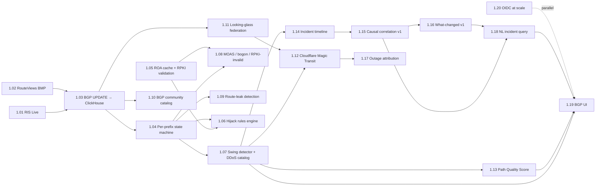

# Phase 1 — BGP + Reasoning — Plan Skeleton

> **Status: skeleton only.** This document quotes the Phase 1 surface
> from the PRD §10 list and pairs each item with the architecture
> decisions that constrain it. The per-task details (file layout,
> acceptance criteria, test corpora, algorithm references) are
> **TBD until the task is opened in `PROJECT_STATE.md §7`** — they
> need to be authored from a deeper read of the PRD section that
> covers each area, not from anyone's memory of how this kind of
> thing is usually built.
>
> **Why a skeleton and not the full breakdown.** An earlier draft of
> this document expanded each task into a Deps/Files/Acceptance/
> Verification block. That draft contained citations and file paths
> taken from training-data memory rather than verified against the
> PRD or the existing codebase, in violation of CLAUDE.md's
> "Never go from memory" rule. It was deleted. This file is the
> grounded replacement: it commits only to what the PRD and CLAUDE.md
> already say, and is honest about which decisions remain open.

---

## Source documents

This skeleton is derived from two ground-truth sources, both at the
workspace root:

- `netsite-prd-v0.4.md` — the canonical product spec. Phase 1 surface
  is **§10 Roadmap**; supporting detail in §5 Functional Requirements
  (BGP / outage / reasoning), §11 Decisions Log (D2, D11), §17
  Appendix C Strategic Position, §18 Appendix D Algorithm Moat
  Documentation Index.
- `CLAUDE.md` — operating constitution. **Architecture Decisions
  A1–A11**, **File Layout (canonical)**, and **Tests** sections
  constrain how each Phase 1 item is implemented, regardless of
  what the task-level detail eventually says.

If anything in this document conflicts with either of those, the
ground-truth source wins.

---

## The 20 Phase 1 work items

Items 1.01–1.19 are the PRD §10 Phase 1 list, lifted verbatim. Item
1.20 (OIDC at scale) comes from PRD §11 Decision **D11**: "Auth:
local-only Phase 0, OIDC by Phase 1 end."

The numbered ordering is a presentation convenience, not a strict
sequence. The dependency graph below is the load-bearing thing.

### Dependency graph

The graph is derived by reading PRD §10's Phase 1 prose: items that
the prose says depend on another (e.g. "with maintained DDoS-provider
catalog" implies the catalog is its own dependency) are linked here.
This is the v1 shape; refine it before opening the task in §7.

### Item list

Each line is verbatim or near-verbatim from PRD §10 Phase 1, with
the architecture decision (A-number) that most directly constrains
the implementation. The package-layout column references the
canonical file layout in CLAUDE.md.

| # | PRD §10 surface | Constrains | Pkg location (CLAUDE.md) |
|---|-----------------|------------|--------------------------|
| 1.01 | RIS Live WebSocket client | — | `pkg/bgp/` |
| 1.02 | RouteViews BMP stream consumer (GoBGP v4) | **A4** | `pkg/bgp/`, BMP listener via gobgp |
| 1.03 | BGP UPDATE → ClickHouse pipeline | **A2** | `pkg/bgp/` + `pkg/store/clickhouse/` schema |
| 1.04 | Per-prefix state machine | — | `pkg/bgp/` |
| 1.05 | ROA cache and RPKI validation | — | `pkg/bgp/` (sub-package TBD) |
| 1.06 | Hijack rules engine | — | `pkg/bgp/` |
| 1.07 | Swing detector with maintained DDoS-provider catalog | — | `pkg/bgp/` + `catalogs/` seed; sister repo `netsite-providers` per CLAUDE.md "Catalog Repos" |
| 1.08 | MOAS / bogon / RPKI-invalid event types | — | `pkg/bgp/` |
| 1.09 | Route-leak (valley-free) detection | — | `pkg/routeleak/` (canonical CLAUDE.md location) |
| 1.10 | BGP community catalog with auto-enrichment | — | `pkg/bgp/` + sister repo `netsite-bgp-catalog` per CLAUDE.md |
| 1.11 | Looking-glass federation | — | `pkg/bgp/` |
| 1.12 | Cloudflare Magic Transit awareness | — | `pkg/integrations/cloudflare/` (canonical CLAUDE.md location) |
| 1.13 | Path Quality Score engine | — | `pkg/pqs/` (canonical CLAUDE.md location) |
| 1.14 | Incident timeline view | — | `pkg/timeline/` + `web/` |
| 1.15 | Causal correlation engine (rule-based v1) | **A7** | `pkg/correlation/` (canonical CLAUDE.md location) |
| 1.16 | What-changed engine | — | `pkg/changedet/` (canonical CLAUDE.md location) |
| 1.17 | Outage attribution with public-feed connectors | — | `pkg/outage/` (canonical CLAUDE.md location) |
| 1.18 | Natural-language incident query (MCP-backed) | **A6** | `pkg/nlquery/` + `pkg/mcp/` (canonical CLAUDE.md locations) |
| 1.19 | BGP UI (prefix list, prefix detail, AS-path tree, swing timeline, correlation panel) | — | `web/` |
| 1.20 | OIDC at scale (PRD D11) | — | `pkg/auth/` (existing) |

### Public outage feed sources (1.17)

Per PRD §5: Cloudflare Radar, RIPEstat, ThousandEyes Internet Insights
Internet Insights, with Downdetector and NLNOG RING marked **P2**
(rate-limited / scrape-tolerant only). The PRD also says
"document terms-of-use compliance" — that's a hard constraint, not
a footnote.

### Looking-glass sources (1.11)

Per PRD §5: Hurricane Electric BGP toolkit, NLNOG RING, Cogent LG,
NTT, RouteViews telnet, AS112 are listed as the built-in adapters.
The PRD's §10 estimate says "3–5 LG sources at launch", so the
shipping subset is a Phase 1 scoping decision (not all six need to
land for the exit gate).

---

## Phase 1 Exit Gate — verbatim from PRD §10

> Track 50 prefixes; detect synthetic swing in <30s; produce a
> complete swing report; MOAS/bogon/RPKI-invalid/leak alerts firing;
> LG federation producing combined views; PQS rendered on overview
> map; causal correlation producing ranked candidate list with
> explainable evidence; what-changed engine answers "what changed
> in the last hour" across synthetic+BGP; outage attribution badge
> appears on alerts; NL query "why was latency to X elevated
> yesterday?" produces a substantive answer with citations.

---

## What is **explicitly TBD** in this skeleton

For each task, the following must be authored *when the task is
opened in `PROJECT_STATE.md §7`* — not before, and not from memory:

- **Files.** The package locations above are ordained at the
  top-level by CLAUDE.md. Sub-package layout (e.g. how `pkg/bgp/`
  decomposes into ingest / state / detectors / connectors) is a
  task-time decision.
- **Acceptance.** The PRD §10 exit-gate sentence is the *ensemble*
  acceptance for Phase 1. Per-task acceptance must be derived from
  the PRD §5 functional-requirements section that covers that task.
- **Verification.** CLAUDE.md "Tests" section lists the categories
  required (unit / integration / property / fuzz / vector /
  snapshot / synthetic-injection / calibration regression). Which
  categories apply per task is task-specific. Test corpora must be
  built fresh — they are explicitly diligence material per CLAUDE.md
  "algorithm-doc ↔ test-corpus crosslink".
- **Effort.** Estimates per task were not in the PRD or
  `PROJECT_STATE.md §8`'s prior-form table. They are the operator's
  judgement at task-open time.
- **Algorithm-doc references.** Per CLAUDE.md "Documentation
  discipline", every nontrivial algorithm needs a `docs/algorithms/<name>.md`.
  Specific RFC / paper / prior-art references for each algorithm
  are research that happens at task-open time, not now.
- **Historical incident corpora.** The swing detector, route-leak
  detector, hijack-rules engine, and correlation engine each
  benefit from replay against a curated historical-incident corpus
  per CLAUDE.md "synthetic-injection tests". Which incidents go in
  the corpus is research that happens at task-open time, not now.

---

## What is **load-bearing** and not negotiable

Per CLAUDE.md "Architecture Decisions":

- **A1**: NATS JetStream is the event bus for every Phase 1 stream
  (BGP UPDATE pipeline, alert events, correlation outputs).
- **A2**: ClickHouse stores every high-cardinality time-series
  Phase 1 produces (BGP UPDATEs, swing events, etc.); Postgres
  stores relational config (rules, registries, per-tenant settings).
- **A4**: gobgp v4 is the BGP stack. No second BGP library lands in
  Phase 1 without explicit re-decision.
- **A6**: NL incident query is implemented as an MCP server, not a
  bespoke NL2SQL system.
- **A7**: Causal correlation v1 is rule-based. Learned ranker is
  Phase 5 work.
- **A11**: Every operator-facing Phase 1 surface defaults to TLS 1.3+.
  The looking-glass federation, the BGP UI, the NL query API — all
  inherit the same TLS-by-default policy that Phase 0 established.

---

## Phase 0 prerequisite

Phase 1 implementation does not start until the **Phase 0
operational soak completes** (3 POPs deployed, 5 real-target
canaries, manual SLO fire drill, anomaly detector running ≥7 days,
end-to-end demo). This is the rule recorded in `PROJECT_STATE.md §1`
and reinforced here so the prerequisite cannot be lost in a
Phase-1-eager rewrite of either document.

The operational soak is what produces the data the Phase 1 reasoning
layer (1.15 correlation, 1.18 NL query) needs in order to be
calibrated against something other than a synthetic test corpus.
